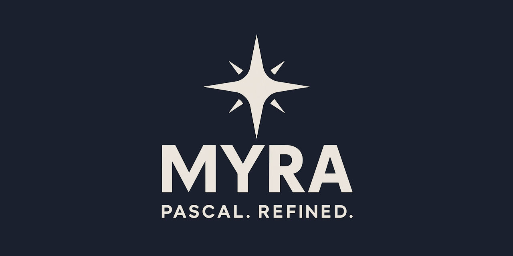
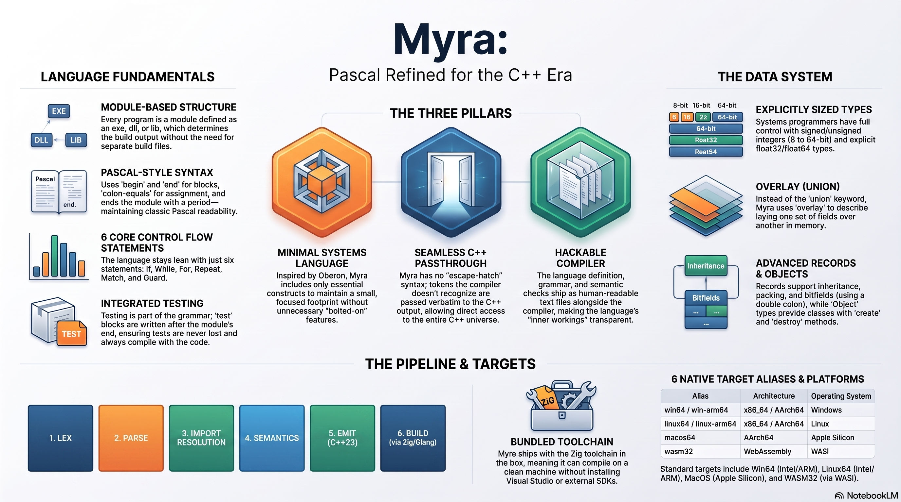

<div align="center">



[](https://discord.gg/Wb6z8Wam7p) [](https://bsky.app/profile/tinybiggames.com)
</div>

## What is Myra?

**A minimal systems programming language where C++ is always one line away.**

Myra compiles to C++ 23 and builds it with a bundled [Zig](https://ziglang.org/) / Clang toolchain. You get everything C++ 23 gives you -- the full standard library, every optimization the compiler can produce, and six native targets -- without writing a line of C++. You write clean, structured Pascal-style code. Myra handles the rest.

```myra
module exe hello;

begin
  println("Hello from Myra!");
end.
```

When you need C++, you just write it. `#include` a header, declare a `std::string`, call `std::abs`, use `new`/`delete`, `static_cast`, `std::vector`, whatever you need. Myra and C++ coexist in the same source file with no wrappers, no bindings, and no escape-hatch syntax. If the compiler does not recognise a token as Myra, it treats it as C++ and passes it through verbatim. The standard library itself is written this way.

Myra takes its syntax philosophy from Oberon: start with Pascal and remove everything that is not essential. What remains is clean, readable, and unambiguous. `begin..end` blocks, `:=` assignment, strong static typing, and a module system that replaces header files entirely. No cruft, no legacy baggage.

**Myra is hackable.** The entire language definition ships as human-readable `.mld` files alongside the compiler. These are not opaque binaries -- they are structured text files that define every token, every grammar rule, every semantic check, and every line of code generation. Read them to understand exactly how a feature works, modify them to change behavior, or extend them to add new ones. The compiler is not a black box.

The entire toolchain ships in the box. Zig, Clang, the C++ runtime, the standard library, the debug adapter -- everything needed to go from source to native binary is included. Unzip, add `bin\` to your `PATH`, write code.

## 🎬 Media

<div align="center">
<br/>  


  

<!-- VIDEO: paste the GitHub user-attachments URL here. This can only be generated by uploading the video through the GitHub web editor. -->

</div>

## 🎯 Who is Myra For?

- **Systems software**: pointer arithmetic, packed records, overlays, and direct memory management. Myra does not hide the machine from you.
- **Game engines and tools**: call C libraries (raylib, SDL3) directly with no boilerplate. Vendor bindings are self-describing -- they carry their own include, library and DLL-copy directives.
- **Shared library development**: export a clean C-ABI surface from a `dll` or `lib` module and consume it from any language that speaks C.
- **Cross-platform CLI tools**: one source, six targets -- Windows, Linux, macOS, and WebAssembly.
- **The browser**: `wasm32` emits a self-contained HTML file with the WASI shim and the wasm bytes inlined. It runs by double-click. No server, no runtime to install.
- **Language hackers**: the `.mld` files are right there. Read how the parser works. Change how code is generated. Add a keyword. Fix an emitter bug without waiting for a release.

## ✨ Key Features

- **Minimal by design**: Oberon-inspired. Only the constructs that earn their place. No second way to do the same thing.
- **Seamless C++ passthrough**: not an escape hatch, the core design. Unrecognised tokens pass through verbatim to C++23.
- **Native binaries**: real executables, shared libraries, and static libraries. No VM, no bytecode, no interpreter.
- **Six targets**: `win64`, `winarm64`, `linux64`, `linuxarm64`, `macos64`, `wasm32`.
- **Rich type system**: records with inheritance, objects with methods and virtual dispatch, overlays, `choices`, sets, fixed and dynamic arrays, typed and untyped pointers, routine types, and bit fields.
- **Explicit linkage**: `cpplink` (default, mangled, supports overloads) and `clink` (C linkage, unmangled) as first-class keywords.
- **Structured exceptions**: `guard` / `except` / `finally`, with hardware faults such as divide-by-zero surfaced as catchable exceptions.
- **Routine overloading**: resolved by parameter signature; the C++ backend mangles names transparently.
- **Sets**: Pascal-style bit sets with membership (`in`), union (`+`), intersection (`*`), and difference (`-`).
- **Managed strings**: reference-counted UTF-8 `string` and UTF-16 `wstring`. Emoji, CJK, and accented text work with no special handling.
- **Full memory control**: `create`/`destroy` for objects, `getmem`/`freemem`/`resizemem` for raw allocation.
- **Variadic routines**: define your own with `...`.
- **Conditional compilation**: `@ifdef` / `@ifndef` / `@elseif` / `@else` / `@endif`, plus the C++ preprocessor via passthrough. They are two different systems and Myra gives you both.
- **Compile-time diagnostics**: `@message hint|warn|error|fatal "text"` -- refuse an unsupported configuration from inside the source.
- **Version info and icons**: embed Windows metadata and an application icon with directives. No resource compiler, no post-build step.
- **Integrated debugger**: DAP-compatible debugging via `-d`. The `@breakpoint` directive marks source locations; breakpoints live in a `.mbp` sidecar.
- **Language server**: an LSP server with hover, go-to-definition, find references, rename, document and workspace symbols, diagnostics, folding, semantic tokens, signature help, inlay hints, formatting, and code actions.
- **Inline test blocks**: `test "name" begin ... end;` with the `testAssert*` family and colour-coded pass/fail output.
- **Hackable compiler**: every token, grammar rule, semantic check and emitter is a readable `.mld` file that ships with the compiler.

## 🚀 Getting Started

Every Myra program is a **module**. The module kind is declared at the top of the file and determines the artifact that gets built. An `exe` module has a `begin..end.` body that serves as the program entry point.

```myra
module exe hello;

routine add(const A: int32; const B: int32): int32;
begin
  return A + B;
end;

begin
  println("Hello from Myra!");
  println("add(2, 3) = {}", add(2, 3));
end.
```

Compile and run:

```bash
Myra -s hello.myra -r
```

`println` takes a format string with `{}` placeholders matched left to right. Format specifiers work as you would expect: `{:.1f}` for fixed-point precision.

| Module Declaration | Output | Description |
|---|---|---|
| `module exe name` | `name.exe` | Native executable |
| `module dll name` | `name.dll` | Shared library |
| `module lib name` | (imported) | Static library, imported by other modules |

### Libraries

A `lib` module exports its surface with `exported`, and picks a linkage. `cpplink` is the default and supports overloading; `clink` gives you an unmangled C ABI.

```myra
module lib test_lib_math;

// Private helper -- only visible within this module
routine dbl(const x: int32): int32;
begin
  return x + x;
end;

// Public -- visible to importing modules
exported routine clink add(const a: int32; const b: int32): int32;
begin
  return a + b;
end;

exported routine clink quadruple(const x: int32): int32;
begin
  return dbl(dbl(x));
end;

end.
```

The consumer just imports it:

```myra
module exe uselib;

import test_lib_math;

begin
  println("add(3, 4) = {}", test_lib_math.add(3, 4));
end.
```

### Two Conditional Systems

Myra has `@ifdef`, and it also gives you the C++ preprocessor. They are not the same thing and they run at different times.

`@ifdef` is resolved by the **Myra lexer, before the compiler**, against Myra's own define table. `#if` is resolved by the **C++ preprocessor, after the compiler**, against the macros the toolchain defines for whichever target Zig was pointed at. Platform detection belongs to `#if` -- the toolchain already knows the target far better than a hand-written define list ever could.

Symbols flow **one way**. Every Myra define is passed to the C++ compiler on the command line as `-DNAME`, so `@define`, the built-in `MYRA`, and the live `TARGET_*` symbol are all visible to a later `#if defined(...)`. The reverse does not hold: `@ifdef` reads only Myra's own table, so the toolchain's platform macros (`_WIN64`, `__linux__`) are invisible to it. It is a one-way mirror, not two sealed rooms.

That difference in **stage** is the whole reason `@ifdef` exists. Only a lexer-stage conditional can switch a build directive on or off, because `@linklibrary`, `@librarypath` and `@copydll` configure the build itself -- and by the time a C++ `#if` runs, the build is already configured.

```myra
module exe target;

@target "win64";

begin
  // Myra-level define, set by the langdef. Also reaches C++ as -DMYRA.
@ifdef MYRA
  println("MYRA defined: yes");
@endif

  // C++ passthrough: the compiler defines these for the selected target.
#if defined(_WIN64)
  println("_WIN64 defined: yes");
#else
  println("_WIN64 defined: no");
#endif
end.
```

### Standard Library

Nine modules ship with the compiler: `Maths`, `StrUtils`, `Console`, `Convert`, `Paths`, `DateTime`, `Files`, `Assertions`, and `Geometry`.

```myra
module exe std;

import
  Maths,
  StrUtils,
  Convert;

begin
  println("Sqrt(4.0) = {}", Maths.Sqrt(4.0));
  println("UpperCase(\"hello\") = {}", StrUtils.UpperCase("hello"));
  println("IntToStr(42) = {}", Convert.IntToStr(42));
end.
```

### Inline Tests

Test blocks live after the module's `end.` and run when `@unitTestMode` is on.

```myra
module exe unittest;

@unitTestMode on;

routine add(const A: int32; const B: int32): int32;
begin
  return A + B;
end;

begin
  println("Hello from unittest!");
end.

test "Addition works correctly"
begin
  testAssertEqualInt(5, add(2, 3));
  testAssertEqualInt(0, add(-1, 1));
end;
```

## 📖 Documentation

The full language reference, directive list, BNF grammar, `.mld` meta-language reference, toolchain guide, embedding API and how-to recipes are in a single document:

| Document | Description |
|---|---|
| **[Myra Documentation](docs/Myra.md)** | Complete tour: types, routines, records, objects, choices, sets, arrays, strings, control flow, exceptions, memory, pointers, overlays, variadics, modules, C++ interop, directives, intrinsics and test blocks. Plus the full BNF grammar, the `.mld` meta-language reference (how to hack the compiler), the toolchain (compiler CLI, DAP debugger, LSP), the embedding API, and task-oriented recipes. |

## 📦 Getting Myra

### Download the Latest Release

**A release is what you need to use Myra.** Cloning the repository is not enough -- the toolchain and the compiled binaries are not in it. A release bundles everything required to go from a `.myra` file to a native binary: the compiler, the Zig/Clang build backend, the C++ runtime, the standard library, the vendor bindings, and the debug adapter. It is pre-built and ready to run.

**[Download the latest release](https://github.com/tinyBigGAMES/MyraLang/releases/latest)**

Unzip it, add `bin\` to your `PATH`. That is the complete installation.

```
MyraLang/
  bin/
    Myra.exe              <- compiler
    res/
      language/           <- .mld language definition files (hackable!)
      runtime/            <- Myra C++ runtime
      libs/std/           <- standard library modules
      libs/vendor/        <- vendor bindings (raylib, SDL3)
      tests/              <- test suite (.myra)
      wasm/               <- WASI shim + browser runner template
      zig/                <- bundled Zig/Clang toolchain
```

### CLI Reference

```bash
Myra -s <file> [options]
```

| Flag | Long form | Description |
|---|---|---|
| `-s` | `--source <file>` | Source file to compile (required) |
| `-o` | `--output <path>` | Output path (default: `output`) |
| `-r` | `--autorun` | Build and run the compiled binary |
| `-d` | `--debug` | Build and debug the compiled binary |
| `-h` | `--help` | Display the help message |

```bash
Myra -s hello.myra              # compile
Myra -s hello.myra -o build     # compile to a specific output path
Myra -s hello.myra -r           # compile and run
Myra -s hello.myra -d           # compile and debug
```

### Target Platforms

Select the target with the `@target` directive.

| Target | Triple | Auto-run (`-r`) |
|---|---|---|
| `win64` | `x86_64-windows-gnu` | Yes, native |
| `winarm64` | `aarch64-windows-gnu` | Build only |
| `linux64` | `x86_64-linux-gnu` | Yes, via WSL |
| `linuxarm64` | `aarch64-linux-gnu` | Build only |
| `macos64` | `aarch64-macos-none` | Build only (Apple Silicon, by design) |
| `wasm32` | `wasm32-wasi` | Yes, opens the emitted HTML in your browser |

Every target builds. A target that cannot auto-run warns; it never errors.

`wasm32` builds with `-fno-exceptions` -- C++ exceptions are impossible on that toolchain, so `guard`/`except` is a compile error there.

### System Requirements

| | Requirement |
|---|---|
| **Host OS** | Windows 10/11 x64 |
| **Linux auto-run** | WSL2 + Ubuntu (`wsl --install -d Ubuntu`) |
| **External toolchain** | None. Zig/Clang is bundled. |

## 🔨 Building the Compiler from Source

This section is for contributors who want to modify the Myra compiler itself. To just write Myra programs, use the release download above.

**You still need a release.** Building from source produces `bin\Myra.exe` and nothing else. It does not produce `bin\res\` -- the Zig/Clang toolchain, the C++ runtime, the standard library, and the vendor bindings all ship in the release and are not in the repository. Without them the compiler has nothing to build with. Download a release first, unzip it, then build your `Myra.exe` over the top of it.

### Prerequisites

| | Requirement |
|---|---|
| **Host OS** | Windows x64 |
| **Compiler** | Delphi 12 Athens or higher |
| **Release** | Required. Supplies `bin\res\` (toolchain, runtime, libraries). |

### Get the Source

```bash
git clone https://github.com/tinyBigGAMES/MyraLang.git
```

### Compile

1. Open `projects\Myra - Pascal. Refined..groupproj` in Delphi
2. Build all projects in the group (Win64)
3. `CLI` builds the compiler to `bin\Myra.exe`
4. `Testbed` compiles and runs every test in `bin\res\tests\` and reports results

## 🤝 Contributing

Myra is an open project and contributions are welcome at every level:

- **Report bugs**: open an issue with a minimal `.myra` reproduction case.
- **Suggest features**: describe the use case first, then the syntax you have in mind.
- **Submit pull requests**: bug fixes, documentation improvements, new test cases, and well-scoped features.

Join our [Discord](https://discord.gg/Wb6z8Wam7p) to discuss development, ask questions, or share what you are building with Myra.

## 💙 Support the Project

If Myra saves you time, sparks an idea, or becomes part of something you ship:

- **Star the repo** -- helps others find the project
- **Spread the word** -- write a post, mention it on social media
- **Join us on [Discord](https://discord.gg/Wb6z8Wam7p)** -- share what you are building
- **Become a sponsor** via [GitHub Sponsors](https://github.com/sponsors/tinyBigGAMES) -- directly funds development

## 📄 License

Myra is licensed under the **Apache License 2.0**. See [LICENSE](LICENSE) for details.

## 🔗 Links

- [Website](https://myralang.org)
- [Discord](https://discord.gg/Wb6z8Wam7p)
- [Bluesky](https://bsky.app/profile/tinybiggames.com)
- [tinyBigGAMES](https://tinybiggames.com)

<div align="center">

**Myra**&#8482; - Pascal. Refined.

Copyright &copy; 2026-present tinyBigGAMES&#8482; LLC
All Rights Reserved.

</div>
